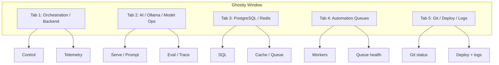

# Terminal Operations Center

A Ghostty-first control surface for backend work, model ops, data services, automation queues, and deployment/log review.

## Operating Idea

Use Ghostty as a live dashboard instead of a passive shell.

- Tabs are major domains.
- Splits are the two things you need most in each domain: control and observation.
- Shortcuts are tuned for fast navigation, cleanup, and config reloads.

## Topology



## Launch

| Method | Command |
|--------|---------|
| Hammerspoon | `⌘⌃5` |
| Shell alias | `ops-center` |
| Direct | `~/.hammerspoon/scripts/ghostty/launch-terminal-operations-center.command` |

Override project directory:

```bash
TERMINAL_OPS_PROJECT_DIR=~/path/to/repo ops-center
```

Default: `~/Documents/01_Projects/BlackDragon_Project` (also set in `~/.zshrc`).

## Per-project pane overrides

Add `.terminal-ops/pane.sh` in your repo with functions named `pane_<id>`:

- `pane_backend-orchestration`
- `pane_backend-telemetry`
- `pane_ai-model-ops`
- `pane_ai-eval-prompt`
- `pane_data-postgresql`
- `pane_data-redis`
- `pane_automation-workers`
- `pane_automation-queue-health`
- `pane_git-deploy`
- `pane_git-logs`

BlackDragon ships overrides at `BlackDragon_Project/.terminal-ops/pane.sh`. Any other repo gets generic fallbacks from `terminal-ops-pane.sh`.

## Ghostty keybinds

Included from Hammerspoon via your main Ghostty config:

```ini
config-file = {home}/.hammerspoon/scripts/ghostty/ghostty-terminal-ops-center.conf
```

- `cmd+enter` — right split
- `cmd+shift+enter` — lower split
- `cmd+h/j/k/l` — jump splits
- `cmd+shift+z` — zoom active split
- `cmd+shift+e` — equalize splits
- `cmd+shift+r` — reload config
- `cmd+1` … `cmd+5` — domain tabs

## Control rhythm

1. Open the relevant tab (`cmd+1` … `cmd+5`).
2. Keep one pane for action and one for proof.
3. Equalize or zoom when the incident demands focus.
4. Reload Ghostty config after keybind changes (`cmd+shift+r`).
